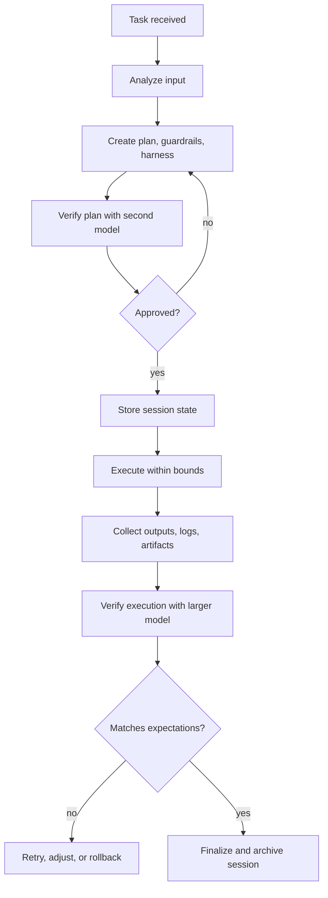
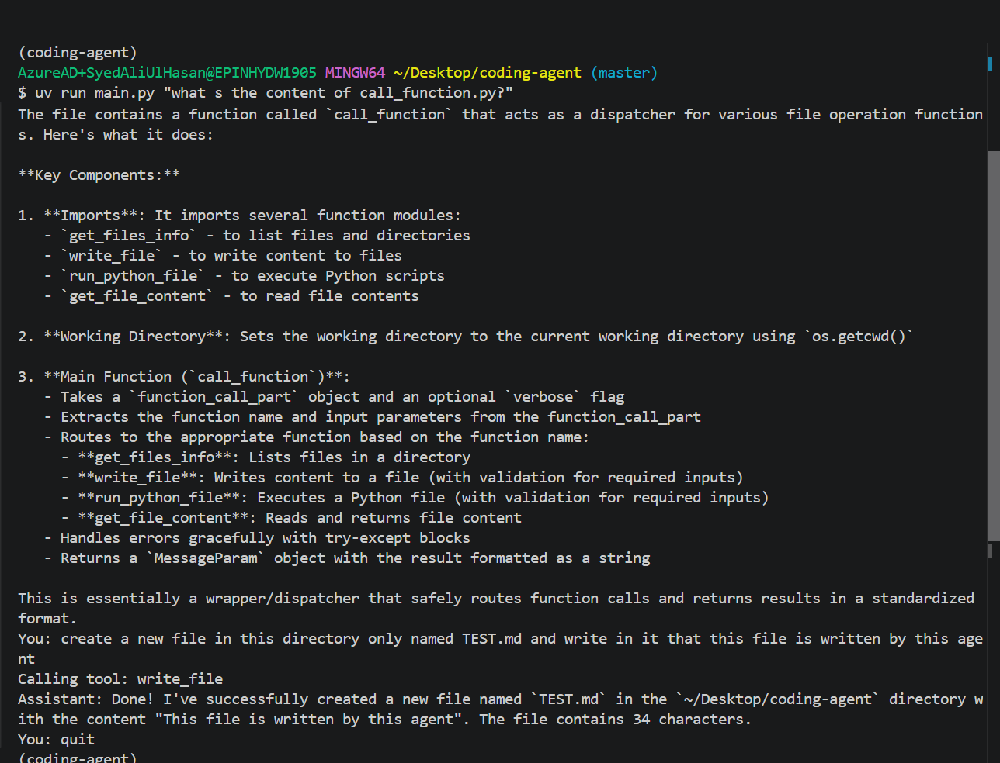

# Agent - Dynamic Harnesses

This repository is a blueprint for a dynamic, multi-model coding agent that can build dynamic harnesses and:

1. Receive a task.
2. Analyze the task deeply before doing anything.
3. Create guardrails, harnesses, checkpoints, and a rollback plan.
4. Execute the task within strict bounds.
5. Verify the result with a separate review pass.
6. Store the session state temporarily so the agent can reason across the whole task.

The goal is not just "call tools". The goal is to make the agent behave like a disciplined workflow engine that plans first, acts second, and validates last.

## What This Agent Should Become

The intended execution flow is:

1. A large reasoning model performs task analysis and decomposes the request.
2. A second strong model reviews the plan, guardrails, and harness.
3. A smaller execution model carries out the bounded steps.
4. A larger verification model checks the outputs, compares them to the plan, and decides whether to accept, retry, or rollback.

This creates a feedback loop where the system does not trust a single pass. It uses different models for different jobs:

- big model for analysis and planning
- second big model for review and safety checks
- small fast model for execution
- big model again for validation and closure

## Core Workflow

The lifecycle for every task should look like this:



### 1. Task Intake

The agent receives a user request and normalizes it into a structured task object.

The task object should include:

- user request text
- task category
- target files or systems
- success criteria
- constraints
- risk level
- estimated effort
- confidence score

### 2. Analysis Pass

The first large model should answer:

- What exactly is being asked?
- What is the smallest safe execution path?
- What are the dependencies and ordering constraints?
- What could fail?
- What should not be changed?
- What evidence will prove success?

The output of this pass should be a plan with explicit substeps, not prose only.

### 3. Harness and Guardrail Generation

For each subtask, the agent should generate:

- a harness: the execution wrapper for that step
- guardrails: what the step is allowed to touch
- checks: how the step will be validated
- rollback instructions: how to undo the step if validation fails
- confidence: how likely the step is to succeed as written

Low-confidence steps should trigger extra verification before execution.

### 4. Plan Review

A second model should review the plan and check for:

- missing dependencies
- unsafe file access
- weak validation coverage
- missing rollback paths
- hidden assumptions
- impossible or vague success criteria

If the review finds a gap, the system should return to planning rather than forcing execution.

### 5. Bounded Execution

The execution model should be the smallest and fastest model that can still perform the work.

It should only receive:

- the approved plan
- the current step
- the allowed tools
- the allowed files or directories
- the expected output format
- the current session state needed for the step

It should not receive unrestricted context if that context is not required.

### 6. Verification and Closure

After execution, a larger model should compare:

- what was planned
- what was actually done
- what changed on disk or in memory
- whether the result satisfies the success criteria
- whether any rollback or follow-up is needed

The verifier should either accept the task, request another pass, or trigger rollback.

## Proposed Architecture

The repository should evolve around four cooperating layers.

### Orchestration Layer

This layer manages the lifecycle of a task.

Responsibilities:

- create task sessions
- route work to the right model
- move between analysis, execution, and verification
- enforce retries and rollback policies
- stop execution when confidence is too low

### Session Memory Layer

This is temporary memory for one task or one conversation.

Store here:

- the task spec
- the current plan version
- the harness definitions
- intermediate findings
- tool outputs
- validation results
- rollback history
- confidence scores

This layer should be treated as ephemeral. It is not long-term knowledge.

### Temporal Database

Use a temporal store to preserve the full task timeline.

Recommended data to persist:

- session id
- timestamped task events
- model decisions
- tool calls and results
- plan revisions
- approval and rejection events
- validation checkpoints
- final outcome

The temporal DB makes debugging and replay possible.

### Vector Database

Use a vector store for semantic retrieval across past work.

Recommended embeddings:

- previous task summaries
- failed execution patterns
- recovered rollback plans
- tool usage patterns
- codebase context
- verification checklists

This lets the agent retrieve similar historical tasks and reuse guardrails that already worked.

## Suggested Data Model

The system should track a task as a state machine.

```text
received -> analyzed -> reviewed -> approved -> executing -> verifying -> finalized
																					 \-> rejected
																					 \-> rolled_back
																					 \-> needs_human_review
```

Suggested session fields:

- `session_id`
- `user_prompt`
- `normalized_task`
- `plan`
- `harness`
- `guardrails`
- `rollback_plan`
- `model_routing`
- `tool_allowlist`
- `confidence_scores`
- `execution_log`
- `verification_report`
- `final_status`

## Execution Policy

The agent should follow these rules:

- Never execute before a plan exists.
- Never execute a step that has no validation strategy.
- Never let the execution model exceed the approved tool and file scope.
- Never keep going when confidence drops below the configured threshold without deeper review.
- Never finalize without a verification pass.
- Always record how to undo each mutation.

### Confidence Handling

Each step should get a confidence score.

Example policy:

- 0.85 to 1.00: execute normally
- 0.60 to 0.84: execute with tighter validation
- below 0.60: require deeper analysis or human intervention

This threshold can be tuned per task type.

## Guardrails

The guardrails should protect against accidental or unsafe behavior.

Examples:

- limit file access to the workspace
- restrict writes to approved files only
- require a rollback plan before any write action
- impose timeouts on long-running operations
- cap tool calls per step
- prevent unplanned dependency installation
- reject tasks that conflict with policy or security rules

## Harness Design

Every subtask should have its own dynamic harness.

A harness should include:

- step name
- goal
- allowed inputs
- allowed tools
- success criteria
- expected outputs
- validation checks
- rollback procedure
- confidence score

The harness is what makes the task executable in a controlled way.

## Suggested Repository Responsibilities

The current repository already contains the beginning of this shape.

- `main.py` is the current CLI loop and model-call entry point.
- `tools/` contains workspace-bound file and execution tools.
- `helpers/` is the right place for the new planning, harness, execution, and verification stages.
- `config.py` centralizes path safety and file read limits.

The helper files are intended to become the staged workflow:

- `helpers/analyse_input.py`: turn a raw user request into a structured task plan
- `helpers/generate_harness.py`: create step-level harnesses and guardrails
- `helpers/execution.py`: run the bounded step while monitoring constraints
- `helpers/verify_harness.py`: review the harness and execution results before acceptance

## Current Tooling

The existing agent can currently:

- list files in the working directory
- read file contents with size limits
- write or update files in the working directory
- run Python files with arguments

All path resolution is restricted to the workspace boundary.

## Recommended Implementation Order

If you are building this system incrementally, use this order:

1. Define the session schema and task state machine.
2. Implement analysis output as structured JSON.
3. Add plan review and approval checks.
4. Create harness generation with per-step guardrails.
5. Add bounded execution with tool allowlists and timeouts.
6. Add post-execution verification and rollback handling.
7. Persist all events in a temporal database.
8. Add vector retrieval for reuse across sessions.
9. Tune confidence thresholds and retry policies.

## Failure Handling and Rollback

The agent should always decide how to undo a step before it executes the step.

Examples:

- If a file write fails validation, restore the previous content.
- If a generated harness is wrong, discard that harness version and regenerate.
- If execution mutates the wrong file, revert only the affected file and re-run verification.
- If the verifier cannot prove success, stop and escalate rather than guessing.

This is essential for keeping the system safe and debuggable.

## Where Human Review Fits

Human intervention should be requested when:

- confidence stays low after a second analysis pass
- the task is ambiguous or underspecified
- rollback would be risky or destructive
- the plan touches an untrusted dependency or environment
- verification cannot reach a clear answer

## Example Session Record

```json
{
	"session_id": "task-2026-09-27-001",
	"status": "verifying",
	"task": "refactor the agent loop into analyze-plan-execute-verify stages",
	"confidence": 0.82,
	"review_status": "approved",
	"rollback_ready": true
}
```

## Example CLI Behavior

The current CLI can be used as the execution shell for the agent loop.

```bash
coding-agent "Add a guarded execution loop with plan review and verification"
```

The final system should use the same CLI entry point, but route through the new staged workflow instead of calling the execution model immediately.

## Example Usage



## Bottom Line

The design in this repository should evolve from a simple tool-calling CLI into a controlled agent runtime with:

- analysis before action
- model-based review before execution
- step-level harnesses and guardrails
- temporary session memory
- temporal audit storage
- vector-based retrieval of prior knowledge
- verification after execution
- rollback when the result is not safe or correct

That is the behavior this project should implement and the behavior the README should guide you toward.
